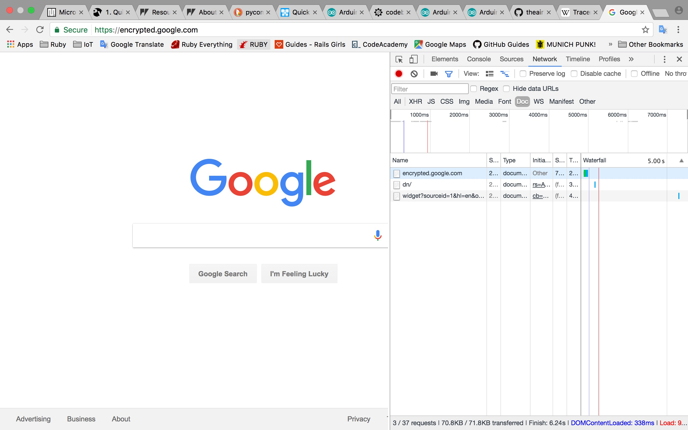
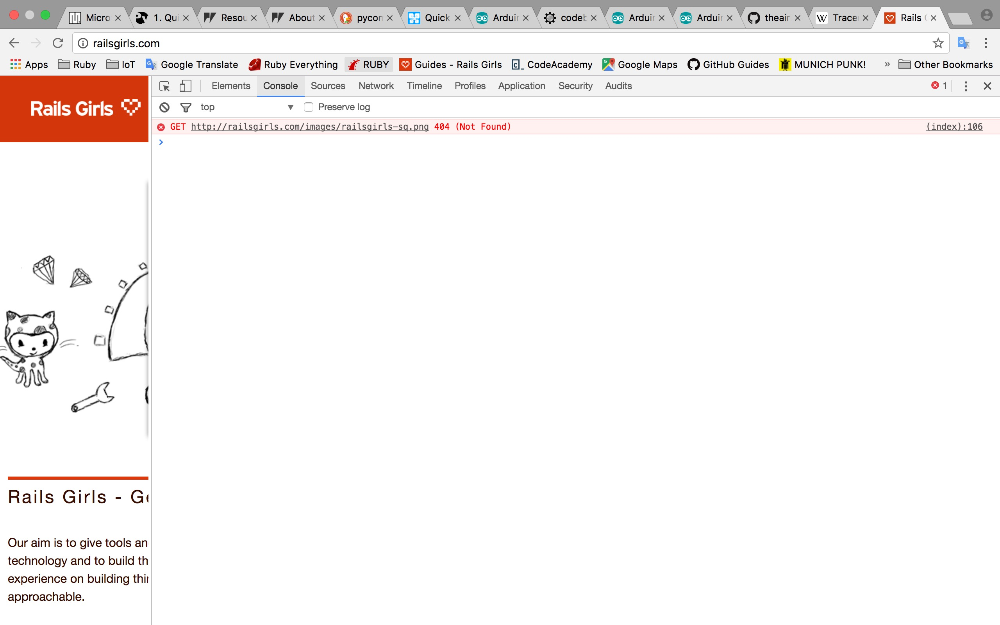
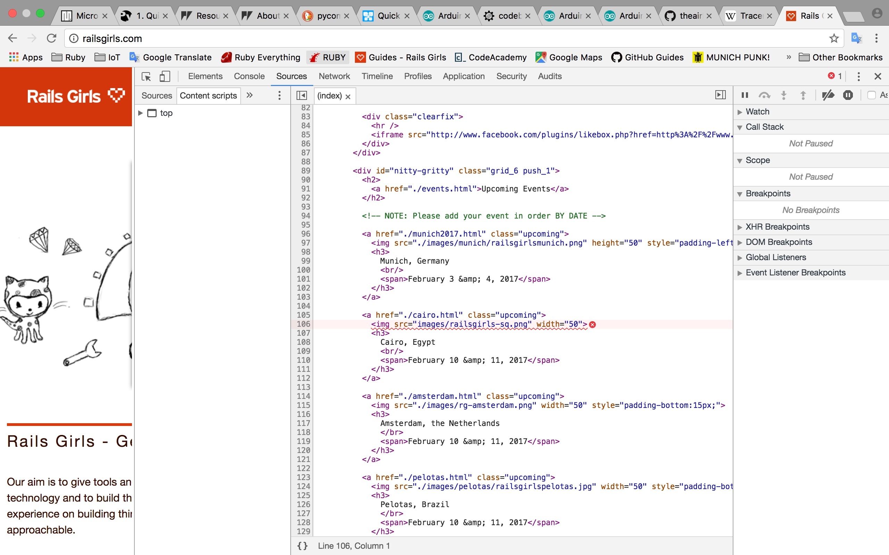
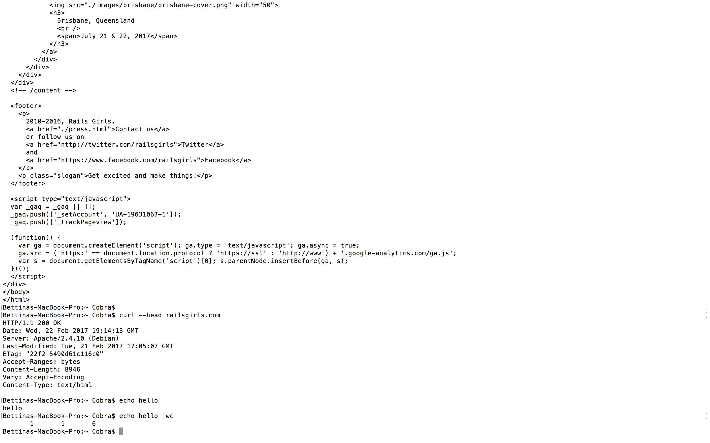
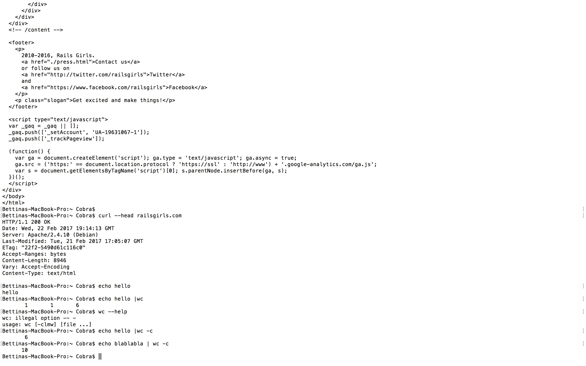
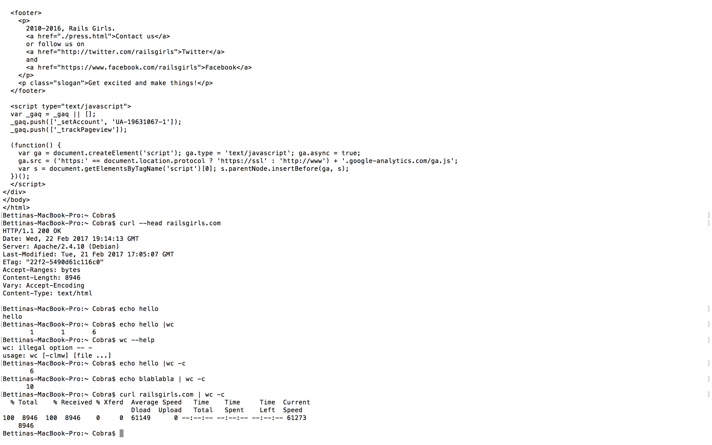

# First RoRMuenchen MeetUp
- opening chrome inspector and

- 404 error

- inspecting 404 error on rails girls website

- using the echo command

- echo word count

- word count of the rails girls website using curl


```shell
$ wc "README.md"
      13      69     534 README.md
```
```ruby
puts "Yo"
```
